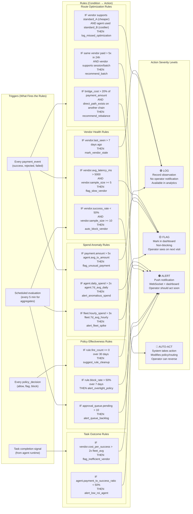
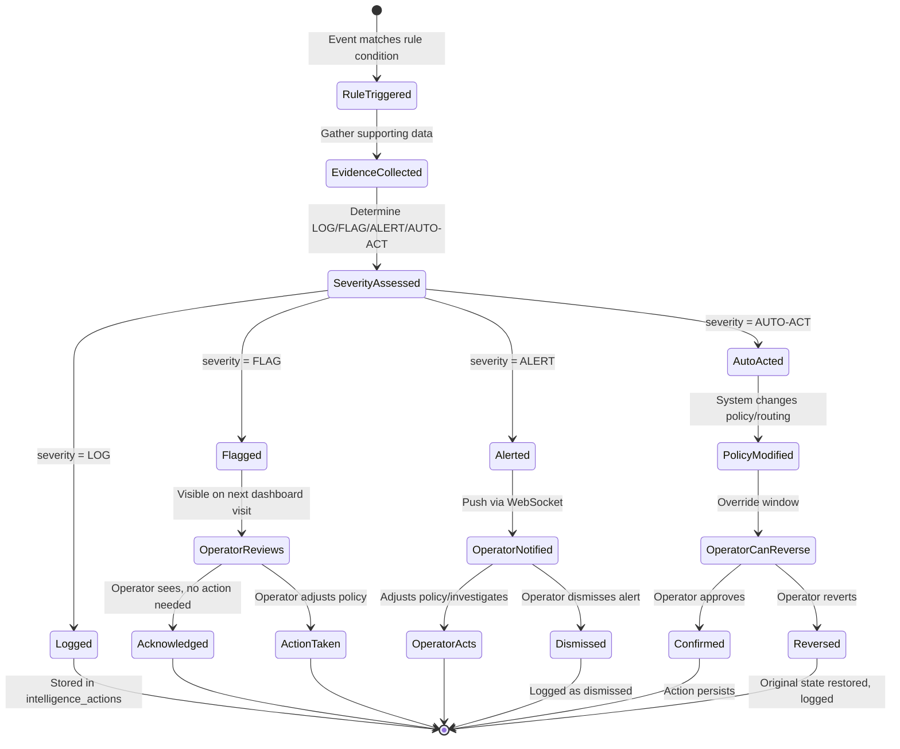
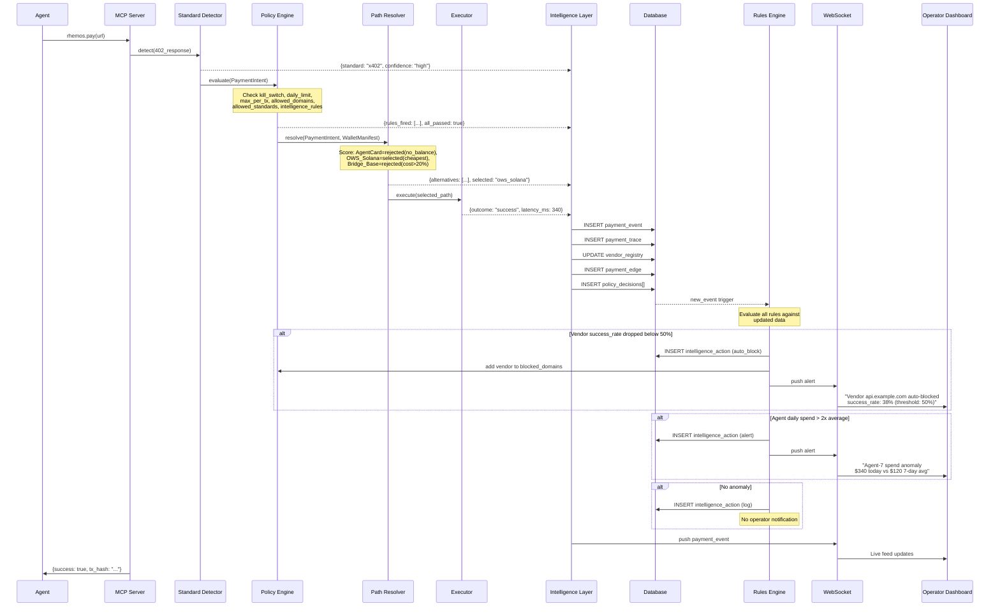

# Rhemos Intelligence Layer — System Diagram

## Full Application Flow

```mermaid
flowchart TB
    subgraph AGENT["Agent Runtime (Claude Code / OpenClaw / Codex)"]
        A1[Agent executes task]
        A2["Hits paywalled API → HTTP 402"]
        A3["Calls rhemos.pay(url)"]
    end

    subgraph MCP["MCP Server Layer"]
        M1["rhemos.pay"]
        M2["rhemos.status"]
        M3["rhemos.set_policy"]
        M4["rhemos.check_policy"]
    end

    subgraph RUNTIME["Payment Runtime (Sean's Workstream)"]
        R1["Standard Detector
        Parse 402 headers → x402 / MPP / L402 / AP2 / ACP
        Confidence: high / medium / low"]

        R2["MPP Normalizer
        Convert detected standard → internal PaymentIntent
        {amount, token, chain, domain, standard, metadata}"]

        R3["Policy Engine
        Evaluate rules in order:
        1. kill_switch → reject all
        2. daily_limit check
        3. max_per_tx check
        4. approval_threshold → queue
        5. allowed_standards check
        6. allowed_domains check
        7. allowed_tokens check
        8. max_bridge_cost_pct check
        9. intelligence_rules check ⬅ NEW"]

        R4["Path Resolver
        Score instruments:
        1. AgentCard (MPP SPT) → if accepted + balance
        2. Direct on-chain match → exact token + chain
        3. Same-chain swap → DEX available
        4. Cross-chain bridge → CCTP / relay.link
        5. Bridge + swap → combined
        6. Fail → structured error"]

        R5["Instrument Executor
        OWS vault → local sign
        Privy → cloud sign
        AgentCard → MPP SPT construct
        Bridge → CCTP / relay.link"]

        R6[Payment Result]
    end

    subgraph INTELLIGENCE["Intelligence Layer (Active Participant)"]

        subgraph INGEST["Event Ingestion"]
            I1["Payment Event Writer
            Append-only, every payment
            success + rejected + failed"]
            I2["Decision Trace Writer
            Full reasoning context
            Immutable, replayable"]
            I3["Policy Decision Writer
            Every rule evaluation
            allow + flag + block"]
        end

        subgraph STORE["Data Store (PostgreSQL)"]
            S1[("payment_events
            id, agent_id, fleet_id, standard,
            amount, token, chain, domain,
            outcome, instrument_type, trace_id")]
            S2[("payment_traces
            agent_task_context, trigger_402_raw,
            alternatives_evaluated, policy_rules_fired,
            instrument_selection_log, confidence,
            replay_snapshot")]
            S3[("vendor_registry
            domain, supported_standards,
            success_rate, avg_latency_ms,
            uptime_pct, last_seen")]
            S4[("payment_edges
            from_agent → to_service,
            delegation_depth, cumulative_spend")]
            S5[("policy_decisions
            rule_triggered, decision,
            threshold, domain, standard")]
            S6[("intelligence_actions
            action_type, trigger_rule,
            evidence, outcome,
            operator_override")]
        end

        subgraph COMPUTE["Rules Engine (Active)"]
            C1["Vendor Health Monitor
            ON every payment_event:
              update vendor success_rate, latency
            RULE: if success_rate < threshold
              → auto_block_vendor
            RULE: if avg_latency > threshold
              → flag_slow_vendor"]

            C2["Spend Anomaly Detector
            ON every payment_event:
              compare agent spend vs 7-day avg
            RULE: if daily_spend > 2x avg
              → alert_anomalous_spend
            RULE: if single_tx > 5x avg_tx
              → flag_unusual_payment"]

            C3["Route Optimizer
            ON every payment_event:
              log path cost + latency
            RULE: if bridge_cost > direct_cost
              for same outcome
              → recommend_cheaper_route
            RULE: if vendor supports cheaper
              standard than detected
              → suggest_standard_switch"]

            C4["Policy Effectiveness Tracker
            ON every policy_decision:
              track rejection_rate per rule
            RULE: if rule blocks > 50% of
              legitimate payments
              → alert_overtight_policy
            RULE: if rule never fires
              → suggest_cleanup"]

            C5["Task Outcome Linker
            ON task completion signal:
              link payment → outcome
            COMPUTE: cost_per_success
              across agents + vendors
            RULE: if vendor cost_per_success
              > 2x fleet average
              → flag_inefficient_vendor"]
        end

        subgraph ACTIONS["Intelligence Actions"]
            ACT1["AUTO-BLOCK
            Block vendor from allowed_domains
            Evidence: success_rate data
            Reversible: operator can override"]

            ACT2["AUTO-FLAG
            Mark payment for review
            Appears in dashboard alerts
            Does NOT block execution"]

            ACT3["AUTO-ALERT
            Push notification to operator
            Anomaly detected, action needed
            Time-sensitive"]

            ACT4["RECOMMEND
            Suggest policy change
            Operator approves or dismisses
            Logged either way"]

            ACT5["AUTO-ROUTE
            Prefer cheaper/faster path
            Within operator-set guardrails
            Logged in trace"]
        end
    end

    subgraph REPLAY["Decision Replay Engine"]
        RE1["Reconstruct Context
        Load replay_snapshot from trace
        Restore: agent state, wallet manifest,
        vendor registry state, policy at time"]
        RE2["Re-run in Sandbox
        Execute policy engine + path resolver
        with reconstructed context
        NO real payment"]
        RE3["Counterfactual Analysis
        Accept policy_overrides param
        'What if daily_limit was $100?'
        Return diff from original"]
    end

    subgraph OPERATOR["Operator Dashboard"]
        D1["Fleet Overview
        Stat cards, agent table,
        live event feed"]
        D2["Decision Trace Viewer
        Full trace with expandable sections
        Click any payment → see WHY"]
        D3["Replay Modal
        Original vs replayed outcome
        Modify policy variables, re-run"]
        D4["Intelligence Feed
        Auto-actions taken,
        recommendations pending,
        anomalies detected"]
        D5["Policy Editor
        Edit rules + guardrails
        See intelligence suggestions
        Accept/dismiss recommendations"]
        D6["Vendor Intelligence
        Reliability scores, latency,
        standards supported, cost/success
        Auto-blocked vendors highlighted"]
    end

    subgraph REALTIME["Real-Time Layer"]
        RT1["WebSocket /api/events/stream
        Push: new events, alerts,
        intelligence actions"]
    end

    %% Main payment flow
    A1 --> A2 --> A3 --> M1
    M1 --> R1 --> R2 --> R3
    R3 -->|"all pass"| R4 --> R5 --> R6
    R3 -->|"rejected"| R6
    R6 -->|"result to agent"| A1

    %% Event emission (every payment)
    R1 -.->|"standard + confidence"| I2
    R3 -.->|"every rule eval"| I3
    R4 -.->|"alternatives + selection"| I2
    R5 -.->|"execution result"| I1
    R6 -.->|"full trace"| I2

    %% Storage
    I1 --> S1
    I2 --> S2
    I3 --> S5
    I1 -.->|"update on every event"| S3
    I1 -.->|"update on every event"| S4

    %% Rules engine triggers
    S1 -->|"new event"| C1
    S1 -->|"new event"| C2
    S1 -->|"new event"| C3
    S5 -->|"new decision"| C4
    S1 -->|"task signal"| C5

    %% Rules engine → actions
    C1 -->|"vendor unhealthy"| ACT1
    C1 -->|"vendor slow"| ACT2
    C2 -->|"anomalous spend"| ACT3
    C2 -->|"unusual payment"| ACT2
    C3 -->|"cheaper route exists"| ACT5
    C3 -->|"better standard"| ACT4
    C4 -->|"policy too tight"| ACT4
    C5 -->|"inefficient vendor"| ACT2

    %% Actions → effects
    ACT1 -.->|"modify policy"| R3
    ACT2 -.->|"flag in dashboard"| D4
    ACT3 -.->|"push alert"| RT1
    ACT4 -.->|"show recommendation"| D5
    ACT5 -.->|"adjust path scoring"| R4

    %% Actions → audit
    ACT1 --> S6
    ACT2 --> S6
    ACT3 --> S6
    ACT4 --> S6
    ACT5 --> S6

    %% Replay flow
    D2 -->|"click Replay"| RE1 --> RE2 --> RE3 --> D3

    %% Real-time to dashboard
    RT1 --> D1
    RT1 --> D4

    %% Operator controls
    D5 -->|"update policy"| R3
    D5 -->|"accept/dismiss"| S6
    D6 -->|"unblock vendor"| R3

    %% MCP status/policy tools
    M2 --> S1
    M3 --> R3
    M4 --> R3

    %% Styling
    classDef runtime fill:#e8f4fd,stroke:#1a56db,color:#000
    classDef intelligence fill:#f0fdf4,stroke:#16a34a,color:#000
    classDef operator fill:#fef3c7,stroke:#d97706,color:#000
    classDef action fill:#fee2e2,stroke:#dc2626,color:#000
    classDef store fill:#f3e8ff,stroke:#7c3aed,color:#000

    class R1,R2,R3,R4,R5,R6 runtime
    class C1,C2,C3,C4,C5 intelligence
    class D1,D2,D3,D4,D5,D6 operator
    class ACT1,ACT2,ACT3,ACT4,ACT5 action
    class S1,S2,S3,S4,S5,S6 store
```

## Intelligence Rules Engine — Detail

```mermaid
flowchart LR
    subgraph TRIGGERS["Triggers (What Fires the Rules)"]
        T1["Every payment_event
        (success, rejected, failed)"]
        T2["Every policy_decision
        (allow, flag, block)"]
        T3["Task completion signal
        (from agent runtime)"]
        T4["Scheduled evaluation
        (every 5 min for aggregates)"]
    end

    subgraph RULES["Rules (Condition → Action)"]
        direction TB

        subgraph VH["Vendor Health Rules"]
            VH1["IF vendor.success_rate < 50%
            AND vendor.sample_size >= 10
            THEN auto_block_vendor"]
            VH2["IF vendor.avg_latency_ms > 5000
            AND vendor.sample_size >= 5
            THEN flag_slow_vendor"]
            VH3["IF vendor.last_seen > 7 days ago
            THEN mark_vendor_stale"]
        end

        subgraph SA["Spend Anomaly Rules"]
            SA1["IF agent.daily_spend > 2x agent.7d_avg_daily
            THEN alert_anomalous_spend"]
            SA2["IF payment.amount > 5x agent.avg_tx_amount
            THEN flag_unusual_payment"]
            SA3["IF fleet.hourly_spend > 3x fleet.7d_avg_hourly
            THEN alert_fleet_spike"]
        end

        subgraph RO["Route Optimization Rules"]
            RO1["IF bridge_cost > 20% of payment_amount
            AND direct_path_exists on another chain
            THEN recommend_rebalance"]
            RO2["IF vendor supports standard_A (cheaper)
            AND agent used standard_B (costlier)
            THEN log_missed_optimization"]
            RO3["IF same vendor paid > 5x in 24h
            AND vendor supports session/batch
            THEN recommend_batch"]
        end

        subgraph PE["Policy Effectiveness Rules"]
            PE1["IF rule.block_rate > 50%
            over 7 days
            THEN alert_overtight_policy"]
            PE2["IF rule.fire_count == 0
            over 30 days
            THEN suggest_rule_cleanup"]
            PE3["IF approval_queue.pending > 10
            THEN alert_queue_backlog"]
        end

        subgraph TO["Task Outcome Rules"]
            TO1["IF vendor.cost_per_success > 2x fleet_avg
            THEN flag_inefficient_vendor"]
            TO2["IF agent.payment_to_success_ratio < 50%
            THEN alert_low_roi_agent"]
        end
    end

    subgraph SEVERITY["Action Severity Levels"]
        SEV1["🟢 LOG
        Record observation
        No operator notification
        Available in analytics"]
        SEV2["🟡 FLAG
        Mark in dashboard
        Non-blocking
        Operator sees on next visit"]
        SEV3["🟠 ALERT
        Push notification
        WebSocket + dashboard
        Operator should act soon"]
        SEV4["🔴 AUTO-ACT
        System takes action
        Modifies policy/routing
        Operator can reverse"]
    end

    T1 --> VH & SA & RO
    T2 --> PE
    T3 --> TO
    T4 --> VH & SA & PE

    VH1 --> SEV4
    VH2 --> SEV2
    VH3 --> SEV1
    SA1 --> SEV3
    SA2 --> SEV2
    SA3 --> SEV3
    RO1 --> SEV3
    RO2 --> SEV1
    RO3 --> SEV2
    PE1 --> SEV3
    PE2 --> SEV1
    PE3 --> SEV3
    TO1 --> SEV2
    TO2 --> SEV3
```

## Intelligence Action Lifecycle

```mermaid
stateDiagram-v2
    [*] --> RuleTriggered: Event matches rule condition

    RuleTriggered --> EvidenceCollected: Gather supporting data

    EvidenceCollected --> SeverityAssessed: Determine LOG/FLAG/ALERT/AUTO-ACT

    SeverityAssessed --> Logged: severity = LOG
    SeverityAssessed --> Flagged: severity = FLAG
    SeverityAssessed --> Alerted: severity = ALERT
    SeverityAssessed --> AutoActed: severity = AUTO-ACT

    Logged --> [*]: Stored in intelligence_actions

    Flagged --> OperatorReviews: Visible on next dashboard visit
    OperatorReviews --> Acknowledged: Operator sees, no action needed
    OperatorReviews --> ActionTaken: Operator adjusts policy
    Acknowledged --> [*]
    ActionTaken --> [*]

    Alerted --> OperatorNotified: Push via WebSocket
    OperatorNotified --> OperatorActs: Adjusts policy/investigates
    OperatorNotified --> Dismissed: Operator dismisses alert
    OperatorActs --> [*]
    Dismissed --> [*]: Logged as dismissed

    AutoActed --> PolicyModified: System changes policy/routing
    PolicyModified --> OperatorCanReverse: Override window
    OperatorCanReverse --> Confirmed: Operator approves
    OperatorCanReverse --> Reversed: Operator reverts
    Confirmed --> [*]: Action persists
    Reversed --> [*]: Original state restored, logged
```

## Data Flow Timeline (Single Payment)

```mermaid
sequenceDiagram
    participant Agent
    participant MCP as MCP Server
    participant SD as Standard Detector
    participant PE as Policy Engine
    participant PR as Path Resolver
    participant EX as Executor
    participant IL as Intelligence Layer
    participant DB as Database
    participant RE as Rules Engine
    participant WS as WebSocket
    participant OP as Operator Dashboard

    Agent->>MCP: rhemos.pay(url)

    MCP->>SD: detect(402_response)
    SD-->>IL: {standard: "x402", confidence: "high"}

    SD->>PE: evaluate(PaymentIntent)
    Note over PE: Check kill_switch, daily_limit,<br/>max_per_tx, allowed_domains,<br/>allowed_standards, intelligence_rules
    PE-->>IL: {rules_fired: [...], all_passed: true}

    PE->>PR: resolve(PaymentIntent, WalletManifest)
    Note over PR: Score: AgentCard=rejected(no_balance),<br/>OWS_Solana=selected(cheapest),<br/>Bridge_Base=rejected(cost>20%)
    PR-->>IL: {alternatives: [...], selected: "ows_solana"}

    PR->>EX: execute(selected_path)
    EX-->>IL: {outcome: "success", latency_ms: 340}

    IL->>DB: INSERT payment_event
    IL->>DB: INSERT payment_trace
    IL->>DB: UPDATE vendor_registry
    IL->>DB: INSERT payment_edge
    IL->>DB: INSERT policy_decisions[]

    DB-->>RE: new_event trigger

    Note over RE: Evaluate all rules against<br/>updated data

    alt Vendor success_rate dropped below 50%
        RE->>DB: INSERT intelligence_action (auto_block)
        RE->>PE: add vendor to blocked_domains
        RE->>WS: push alert
        WS->>OP: "Vendor api.example.com auto-blocked<br/>success_rate: 38% (threshold: 50%)"
    end

    alt Agent daily spend > 2x average
        RE->>DB: INSERT intelligence_action (alert)
        RE->>WS: push alert
        WS->>OP: "Agent-7 spend anomaly<br/>$340 today vs $120 7-day avg"
    end

    alt No anomaly
        RE->>DB: INSERT intelligence_action (log)
        Note over RE: No operator notification
    end

    IL->>WS: push payment_event
    WS->>OP: Live feed updates

    MCP->>Agent: {success: true, tx_hash: "..."}
```
